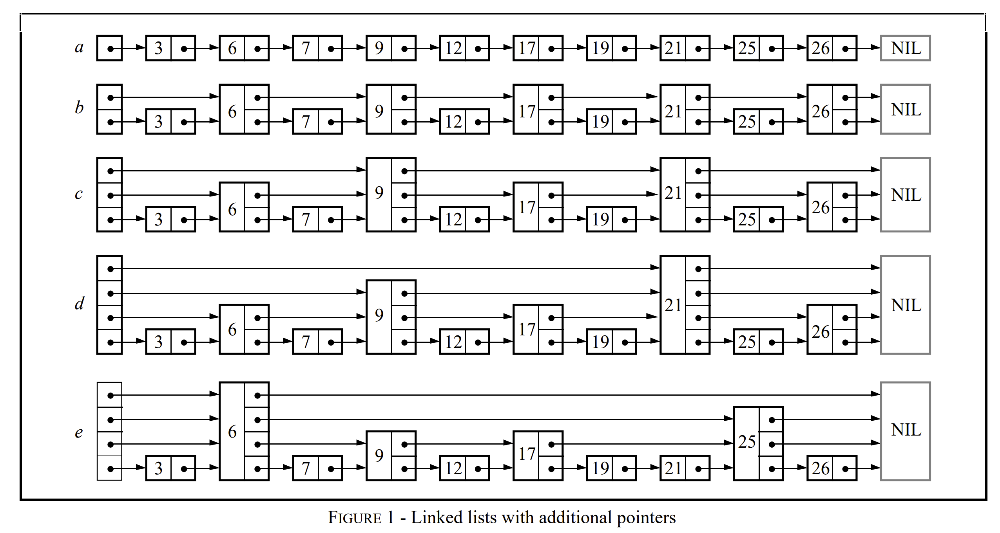

# Introduction

## 跳表原理
跳表是一种基于链表的数据结构，其使用概率进行平衡，而不是向平衡树一样强制平衡。其查询效率较高，查找、插入、删除的平均时间复杂度都是`O(logn)`，许多项目中都采用了跳表，如redis、levelDB、RocksDB等等

### 核心结构

### 核心功能

- 查找 
  - 输入：key
  - 输出：最底层链表中的位置 index
  - 在每一层查找，一旦找到比key大的位置（而没有找到key），就向下一层。在下一层中，以第一个不大于key的位置开始进行遍历，直到最后一层

- 插入
  - 输入：key， value
  - 输出：是否成功 bool
  - 找到底层链表中key的位置，插入。随机取值(0,maxLevel)，该值决定了该节点的level，在给定的每个level处插入该节点
- 删除
  - 输入：key
  - 输出：是否成功 bool
  - 找到底层链表中key的位置，将整个节点都删除，调整指针关系

- 修改 = 删除 + 插入

## 需求分析
1. 插入数据
2. 删除数据
3. 查询数据
4. 展示已存储数据
5. 数据落盘
6. 加载数据
7. 返回数据规模